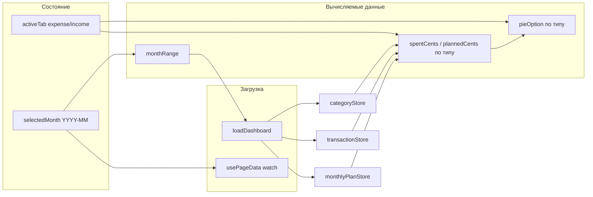

# Табы «Расходы»/«Доходы» и переключатель месяца на главной

## Текущее состояние

- [HomePage.vue](src/pages/home/ui/HomePage.vue): один круговой график (траты по категориям расходов + «Остаток» от плана), центр — план/факт. Месяц захардкожен как текущий (`getCurrentMonth()`).
- Данные: `categoryStore` (типы `expense`/`income`), `transactionStore` (поле `type`), `monthlyPlanStore.planItems` (сейчас в UI используются только для расходов).
- Есть [TheTabs](src/shared/ui/TheTabs.vue) (обёртка над a-tabs), [TheDatePicker](src/shared/ui/TheDatePicker.vue) и [getCurrentMonth](src/shared/lib/date.ts) / [getMonthRange](src/shared/lib/date.ts).

## Использование TheDatePicker для выбора месяца

**Требование:** использовать существующий компонент [TheDatePicker](src/shared/ui/TheDatePicker.vue).

Сейчас TheDatePicker:

- жёстко завязан на VeeValidate (`name`, `useField`);
- не поддерживает режим выбора только месяца (`picker="month"`);
- обёрнут в `Form.Item`.

**Если текущего API недостаточно** — доработать TheDatePicker:

1. **Автономный режим (без формы):** опциональное использование без VeeValidate: при отсутствии `name` (или при явном пропе, например `standalone`) не вызывать `useField`, использовать локальный `ref` и двустороннее связывание через `v-model` (или `modelValue`/`update:modelValue`). Рендерить без `Form.Item` или с минимальной обёрткой (только label для a11y).
2. **Режим «месяц»:** добавить проп `picker?: 'date' | 'month'` (по умолчанию `'date'`). При `picker="month"` передавать в a-date-picker `picker="month"` и подходящий `format` (например `'MM.YYYY'` или `'MMMM YYYY'` для отображения). Значение хранить в формате `YYYY-MM` (строка) для совместимости с `getMonthRange` и API.
3. **JSDoc и тесты:** по правилам проекта — обновить JSDoc (русский) для новых пропов; при изменении публичного API добавить/обновить тесты в [TheDatePicker.spec.ts](src/shared/ui/TheDatePicker.spec.ts).

На главной странице использовать TheDatePicker в режиме месяца для `selectedMonth`, разместив его над табами (без оборачивания всей страницы в форму — за счёт автономного режима).

## Остальные изменения

### 1. Выбранный месяц и перезагрузка данных

- Ввести состояние выбранного месяца: `ref<string>` с инициализацией `getCurrentMonth()` (например `selectedMonth`).
- Все вычисления, зависящие от месяца, перевести на `selectedMonth`: `monthRange = computed(() => getMonthRange(selectedMonth.value))`, в `loadDashboard` использовать `selectedMonth` для запроса транзакций и плана (year/month из `selectedMonth`).
- В [usePageData](src/shared/lib/usePageData.ts) в `watchSources` добавить `() => selectedMonth.value`, чтобы при смене месяца данные перезапрашивались.

### 2. Переключатель периода над графиком

- Над блоком с графиком (и над табами) разместить **TheDatePicker** в режиме выбора месяца, привязанный к `selectedMonth`. По умолчанию выбран текущий месяц (инициализация `selectedMonth`).
- Доступные месяцы: при необходимости ограничить (например не позже текущего месяца) — опционально по ТЗ.

### 3. Табы «Расходы» и «Доходы»

- Добавить состояние активной вкладки: `ref<'expense' | 'income'>('expense')`.
- Разметка: [TheTabs](src/shared/ui/TheTabs.vue) с двумя вкладками: ключи `expense` / `income`, подписи «Расходы» / «Доходы». Контент каждой вкладки — один и тот же блок: график + подпись в центре (данные подставляются по `activeTab`).
- Переключатель месяца — общий, над табами.

### 4. Данные графика по типу (расходы / доходы)

- Вынести логику в computed, зависящие от активной вкладки:
  - **Расходы:** как сейчас — категории `type === 'expense'`, транзакции по expense-категориям, план — `planItems`. Суммы `spentCents` / `plannedCents`, секции по категориям + «Остаток» (план − факт).
  - **Доходы:** категории `type === 'income'`, транзакции с `type === 'income'`. Планы по доходам в приложении не ведутся — график только факт по категориям; «Остаток» не показывать (или только при наличии планов по доходам).
- Один и тот же блок графика (VChart + центр): опции и подписи в центре берутся из computed в зависимости от `activeTab`.

### 5. Структура шаблона

- `ThePageHeader`
- `ThePageDataBoundary`
  - Переключатель месяца (TheDatePicker, режим месяца) — над табами
  - TheTabs (Расходы | Доходы), контент — общий блок с графиком и подписью по данным выбранного таба
  - Блок кнопок «Внести расход» / «Внести доход»

### 6. Файлы для правок

- [src/shared/ui/TheDatePicker.vue](src/shared/ui/TheDatePicker.vue) — доработка при необходимости: автономный режим, `picker="month"`, формат значения `YYYY-MM`. JSDoc и тесты.
- [src/pages/home/ui/HomePage.vue](src/pages/home/ui/HomePage.vue) — состояние месяца и таба, TheDatePicker, TheTabs, разбиение computed по типу и подстановка в график.

## Диаграмма потока данных

