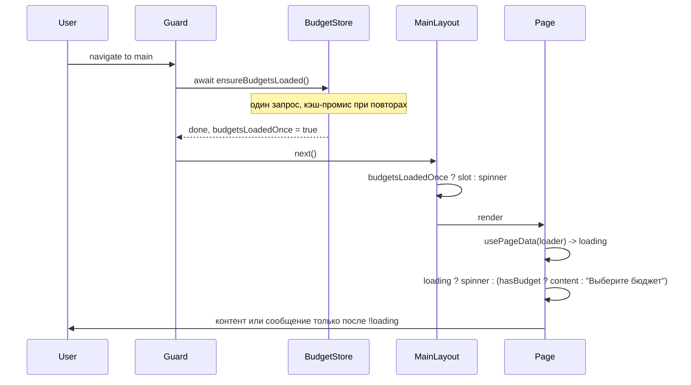

# План: лоадер при незагруженных данных (гибрид 1+2, без дублирования API и без раннего «нет контента»)

## Цели

1. **Нет дублирования вызовов API** — загрузка бюджетов инициируется в одном месте; повторные вызовы используют один и тот же промис или явный refresh.
2. **Не показывать сообщение об отсутствии контента до завершения загрузки** — пока данные не загружены, показывать только лоадер; «Выберите бюджет» / пустое состояние только после того, как загрузка завершена и контента действительно нет.

---

## Текущие вызовы fetchBudgets

| Место                                                                     | Когда                                    |
| ------------------------------------------------------------------------- | ---------------------------------------- |
| [main.ts](src/app/entrypoint/main.ts)                                     | После `restoreSession()` в `.then()`     |
| [BudgetSwitcher.vue](src/widgets/budget-switcher/ui/BudgetSwitcher.vue)   | `onMounted`, если `budgets.length === 0` |
| [BudgetsPage](src/pages/budgets/ui/BudgetsPage.vue)                       | В своей `load()`                         |
| [BudgetSettingsPage](src/pages/budget-settings/ui/BudgetSettingsPage.vue) | В своей `load()` вместе с invitations    |

Итог: при первом заходе возможны два вызова (main + guard или main + BudgetSwitcher). Нужна одна точка входа.

---

## Часть 1: Один источник загрузки бюджетов (без дублирования)

### 1.1 Store: `ensureBudgetsLoaded()` и флаг «уже загружали»

**Файл:** [src/entities/budget/model/store.ts](src/entities/budget/model/store.ts)

- Добавить в замыкании:
  - `budgetsLoadedOnce = ref(false)` — выставлять в `true` в `fetchBudgets()` в `finally`.
  - `budgetsLoadPromise: Promise<void> | null = null` — кэш промиса текущей загрузки.
- Добавить метод `ensureBudgetsLoaded(): Promise<void>`:
  - если `budgetsLoadPromise !== null` — вернуть его (один запрос на всех подписчиков);
  - иначе: `budgetsLoadPromise = fetchBudgets().then(() => {}).finally(() => { budgetsLoadPromise = null })`, вернуть этот промис.
- Экспортировать `budgetsLoadedOnce` в return store.

Итог: кто угодно вызывает только `ensureBudgetsLoaded()`; первый вызов делает запрос, остальные ждут тот же промис. Явное обновление списка (после создания бюджета и т.п.) — отдельно через `fetchBudgets()`.

### 1.2 Убрать стартовый вызов из main.ts

**Файл:** [src/app/entrypoint/main.ts](src/app/entrypoint/main.ts)

- Удалить вызов `budgetStore.fetchBudgets()` из `.then(restored)`. Загрузку бюджетов для main-маршрутов выполняет только гард (см. ниже).

### 1.3 Гард — единственная точка старта загрузки для main

**Файл:** [src/app/providers/router/guards.ts](src/app/providers/router/guards.ts)

- Для маршрутов с `meta.requiresAuth === true` и `meta.layout === 'main'` после проверок сессии вызвать `await budgetStore.ensureBudgetsLoaded()`.
- Навигация на страницу произойдёт только после завершения загрузки бюджетов (успех или ошибка — в любом случае `budgetsLoadedOnce` станет true после завершения).

### 1.4 BudgetSwitcher — не дублировать запрос

**Файл:** [src/widgets/layouts/main/...] / [src/widgets/budget-switcher/ui/BudgetSwitcher.vue](src/widgets/budget-switcher/ui/BudgetSwitcher.vue)

- В `onMounted` вместо `budgetStore.fetchBudgets()` вызывать `budgetStore.ensureBudgetsLoaded()`. Если гард уже загрузил — промис уже resolved, повторного запроса не будет. Если по какой-то причине попали в main без вызова гарда — запрос выполнится один раз.

### 1.5 Страницы: только явный refresh

- **BudgetsPage** / **BudgetSettingsPage**: оставить вызов обновления списка бюджетов только там, где это намеренное обновление после действия пользователя (создание/редактирование). Для первичной загрузки полагаться на гард: к моменту монтирования страницы `ensureBudgetsLoaded()` уже выполнен. Если в их `load()` вызывается `fetchBudgets()` для «свежего» списка при открытии — заменить на `ensureBudgetsLoaded()` при первом заходе или убрать, если данных из store достаточно.

Итог по API: один запрос бюджетов при заходе на main — инициируется гардом; BudgetSwitcher и страницы используют `ensureBudgetsLoaded()` (без дублирования) или явный `fetchBudgets()` только для refresh.

---

## Часть 2: Не показывать «нет контента» до завершения загрузки

### 2.1 MainLayout: контент только после готовности бюджетов

**Файл:** [src/widgets/layouts/main/ui/MainLayout.vue](src/widgets/layouts/main/ui/MainLayout.vue)

- Использовать `budgetStore.budgetsLoadedOnce`.
- В области контента: пока `!budgetsLoadedOnce` — рендерить только полноэкранный лоадер (например `<TheSpin>` по центру); иначе — `<slot />` (router-view).

Так страницы с «Выберите бюджет» не монтируются до тех пор, пока загрузка бюджетов не завершена. Сообщение «Выберите бюджет» или «Нет бюджетов» пользователь увидит только после того, как мы уже знаем результат загрузки.

### 2.2 Страницы: не показывать пустое состояние при loading

- На страницах, где есть и загрузка данных (категории, транзакции и т.д.), и блок «Выберите бюджет»:
  - Сначала проверять «идёт загрузка данных страницы» (`loading === true`). Пока `loading` — показывать только лоадер (TheSpin), не «Выберите бюджет» и не пустой список.
  - «Выберите бюджет» показывать только когда `!loading` и при этом `!hasBudget`.
- В едином компоненте обёртке (ThePageDataBoundary) порядок условий:
  1. Если **ещё не готовы данные уровня layout** (бюджеты) — не должно происходить, т.к. MainLayout не рендерит slot до `budgetsLoadedOnce`; при необходимости можно передать `dataReady` (например `budgetsLoadedOnce`) и показывать лоадер при `!dataReady`.
  2. Иначе если **идёт загрузка данных страницы** (`loading`) — показывать только лоадер.
  3. Иначе если **нет выбранного бюджета** (`!hasBudget`) — «Выберите бюджет».
  4. Иначе если **есть ошибка** — показать ошибку.
  5. Иначе — контент.

Так ни на уровне layout, ни на уровне страницы не будет ситуации «контента ещё нет, а уже показываем сообщение об отсутствии контента».

### 2.3 Уточнение по `dataReady` на странице

- Поскольку MainLayout не рендерит router-view до `budgetsLoadedOnce`, страница всегда монтируется уже при «готовых» бюджетах. Поэтому на странице достаточно: `loading` (данные страницы) и `hasBudget`. Дополнительный `dataReady` в boundary нужен только если в будущем появятся сценарии, когда страница рендерится до готовности бюджетов — на текущем плане можно не вводить.

---

## Часть 3: Единая логика на страницах (кратко)

- **usePageData(loader, { watchSources })** — один composable: `loading`, `error`, запуск loader при mount и при изменении watchSources; возврат `{ loading, error, reload }`.
- **ThePageDataBoundary** — обёртка: пока `loading` — лоадер; при `!loading && !hasBudget` — «Выберите бюджет»; при `!loading && hasBudget && error` — ошибка; иначе — слот с контентом. Так сообщение об отсутствии контента не показывается пока `loading === true`.

Остальное по страницам и рефакторингу — как в исходном плане (пошаговый рефакторинг Home, Categories, Accounts и т.д. на usePageData + ThePageDataBoundary).

---

## Порядок внедрения

1. **Store:** добавить `budgetsLoadedOnce`, `ensureBudgetsLoaded()`, кэш-промис; в `fetchBudgets()` выставлять `budgetsLoadedOnce = true` в `finally`.
2. **main.ts:** убрать вызов `fetchBudgets()` из `.then(restored)`.
3. **Guards:** для `requiresAuth` + `layout === 'main'` вызывать `await budgetStore.ensureBudgetsLoaded()`.
4. **MainLayout:** лоадер в контенте пока `!budgetsLoadedOnce`, затем slot.
5. **BudgetSwitcher:** в onMounted вызывать `ensureBudgetsLoaded()` вместо `fetchBudgets()`.
6. **Страницы (BudgetsPage, BudgetSettingsPage):** при необходимости оставить только явный refresh через `fetchBudgets()` после действий; первичную загрузку не дублировать.
7. **Shared:** `usePageData`, `ThePageDataBoundary` с правильным порядком условий (loader → empty → error → content).
8. **Рефакторинг страниц** на usePageData + ThePageDataBoundary.

---

## Итоговая схема

- **Один вызов API бюджетов** на заход в main — из гарда; BudgetSwitcher и страницы используют `ensureBudgetsLoaded()` без дублирования.
- **Сообщение «нет контента»** показывается только после завершения загрузки: на уровне layout — слот не показывается до `budgetsLoadedOnce`; на уровне страницы — пустое состояние только при `!loading`.

