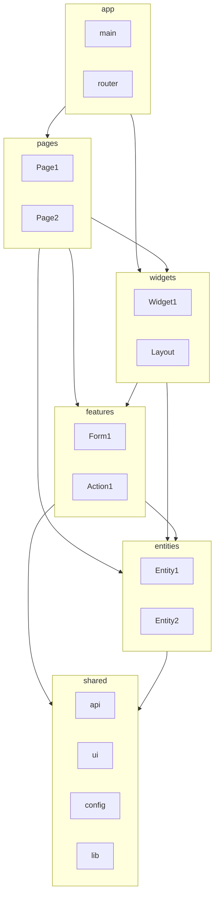

# План поэтапного внедрения архитектуры budget-app-client

План для поэтапного внедрения крупных архитектурных решений. Каждая группа — самостоятельный этап, который можно внедрять и проверять отдельно. Правила и соглашения: [.cursor/rules/architecture.mdc](.cursor/rules/architecture.mdc).

---

## Сохраняемые файлы и каталоги

При выполнении плана **не удалять** и **не перезаписывать содержимое** следующих путей (при необходимости только дополнять, например новые строки в `.gitignore`):

- `.gitignore`
- `Dockerfile`
- `README.md`
- `.cursor/` (вся директория: rules, plans, commands и остальное)
- `.github/`
- `docs/`

Команды и шаги плана (в т.ч. инициализация Vite) выполнять так, чтобы эти файлы и каталоги оставались нетронутыми. Если шаблон или скрипт предлагает перезаписать один из них — пропустить перезапись или объединить изменения вручную без потери существующего содержимого.

---

## 1. Базовая структура проекта

### 1.1. Инициализация

- Создать Vite-проект: `npm create vite@latest . -- --template vue-ts`. Не перезаписывать пути из раздела «Сохраняемые файлы и каталоги».
- Prod-зависимости: `vue`, `vue-router`, `pinia`, `axios`, `ant-design-vue`, `@vueuse/core`, `vee-validate`, `@vee-validate/zod`, `zod`, `vue-echarts`, `echarts`, `@vicons/ionicons5`
- Dev-зависимости: `typescript`, `vue-tsc`, `@vitejs/plugin-vue`, `@types/node`, `@vue/tsconfig`, `rollup-plugin-visualizer`

### 1.2. Конфигурация

- **vite.config.ts**: alias `@` → `./src`, manualChunks для echarts/vue-vendor/entities, `build:analyze` скрипт
- **tsconfig**: project references, strict mode, paths `@/*`
- **Точка входа** ([src/app/entrypoint/main.ts](src/app/entrypoint/main.ts)): `await router.isReady()` перед `app.mount('#app')`

### 1.3. Структура FSD

```bash
mkdir -p src/app/entrypoint src/app/providers/router src/app/styles
mkdir -p src/pages src/widgets src/features src/entities src/shared
mkdir -p src/shared/api src/shared/config src/shared/lib src/shared/ui
```

Правило импортов: только из нижних слоёв. Публичный API — через `index.ts`. Порядок: app → pages → widgets → features → entities → shared.

### 1.4. API (axios)

- `.env.example`: `VITE_API_BASE_URL`, `VITE_API_TIMEOUT_MS`. **Base URL** должен включать префикс `/api` (бэкенд монтирует роутер на `/api`). Пример: `http://localhost:3000/api`.
- **Credentials:** для всех запросов к API задать `withCredentials: true` в axios, чтобы браузер отправлял cookies. Необходимо для `POST /api/auth/refresh`, который читает refresh-токен из HttpOnly cookie.
- **CORS:** для разработки на другом порту бэкенд должен иметь `CORS_ORIGINS` с origin фронта (например `http://localhost:5173`) и `CORS_CREDENTIALS=true`. Указать это в `.env.example` или в описании окружения (см. бэкенд: `src/middlewares/cors.js`).
- [src/shared/api/config.ts](src/shared/api/config.ts), [errors.ts](src/shared/api/errors.ts), [httpClient.ts](src/shared/api/httpClient.ts), [request.ts](src/shared/api/request.ts), [useApi.ts](src/shared/api/useApi.ts)
- Interceptors: Bearer token, 401 refresh, toast при ошибках (кроме `_suppressErrorNotification`)
- **Формат ошибок API:** ответ ошибки от бэкенда — `{ error: { code: string, message: string } }`. В `toApiError` / перехватчике ошибок парсить это тело и передавать в toast/обработчик; при необходимости обрабатывать типичные коды (например 409 «Email already in use») для осмысленных сообщений в формах логина/регистрации.

### 1.5. Авторизация (auth)

Контракт бэкенда: [docs/authentication.md](docs/authentication.md).

- **Хранение accessToken:** после логина/регистрации сохранять `accessToken` в Pinia store; при необходимости — sessionStorage для сохранения между перезагрузками в рамках сессии. Refresh-токен на фронте не хранить (он только в HttpOnly cookie).
- **Refresh по 401:** при 401 от защищённого эндпоинта один раз вызывать `POST /api/auth/refresh` (с `withCredentials: true`); при успехе — обновить accessToken и повторить исходный запрос; при неуспехе — редирект на страницу входа и очистка состояния.
- **Страницы и фичи auth:**
  - Страница входа: форма email + password, `POST /api/auth/login`, сохранение accessToken и данных пользователя.
  - Страница регистрации: форма email, password, firstName, lastName, `POST /api/auth/register`, сохранение accessToken и user.
  - Смена пароля: защищённая страница/модалка, форма currentPassword + newPassword, `POST /api/auth/change-password`.
  - Управление сессиями: страница со списком сессий (`GET /api/auth/sessions`), ревокация одной (`DELETE /api/auth/sessions/:sessionId`) или всех кроме текущей (`DELETE /api/auth/sessions`).
- **Logout:** вызов `POST /api/auth/logout` (с credentials), очистка accessToken и состояния пользователя на фронте.

### 1.6. Валидация (Zod + VeeValidate)

- [src/shared/lib/validation/primitives.ts](src/shared/lib/validation/primitives.ts): `nonEmptyString`, `email`, `password`, `uuid`, `phoneE164`, `optionalTrimmedString`, `nullableTrimmedString`, `positiveInt`, `nameField`
- [src/shared/lib/validation/errors.ts](src/shared/lib/validation/errors.ts): `toFieldErrors(ZodError)`

### 1.7. Темы

- [src/shared/config/theme/](src/shared/config/theme/): `types.ts`, `constants.ts`, `light.ts`, `dark.ts`, `monochrome.ts`, `getThemeOverrides.ts`, `useTheme.ts`
- [src/app/styles/tokens.css](src/app/styles/tokens.css): CSS-переменные для `data-theme`
- `index.html`: `data-theme="light"` на `<html>`
- `App.vue`: ConfigProvider (ant-design-vue) с theme/token overrides, layout из `route.meta.layout`

### 1.8. Дополнительно

- Шрифты: `src/app/styles/fonts.css`, `scripts/download-fonts.mjs`
- ECharts: `registerECharts()` в main.ts, импорт `vue-echarts/style.css`
- Обработка ошибок: `toApiError`; при смене темы — обновление message/notification API ant-design-vue при необходимости

---

## 2. Линтер и форматирование

### 2.1. Зависимости

```bash
npm install -D eslint @eslint/js typescript-eslint eslint-plugin-vue eslint-plugin-import-x eslint-config-prettier prettier globals
```

### 2.2. ESLint (flat config)

- [eslint.config.js](eslint.config.js): js, tseslint, pluginVue, pluginImportX, eslintConfigPrettier
- Ignores: `dist`, `node_modules`, `public`, `**/*.config.*`, `coverage`, `scripts`
- Vue: `multi-word-component-names`, `component-name-in-template-casing` (PascalCase, ignores `/^a-/` для ant-design-vue), `attributes-order`, `max-attributes-per-line`
- Import order: pathGroups для FSD слоёв, `newlines-between`, alphabetize

### 2.3. Prettier

- `.prettierrc`: `semi: false`, `singleQuote: true`, `tabWidth: 4`, `trailingComma: none`, `printWidth: 120`, `singleAttributePerLine: true`
- `.prettierignore`: `dist`, `node_modules`, `public`, `*.lock`, `coverage`, `public/fonts`

### 2.4. Husky + lint-staged

```bash
npx husky init
```

- `package.json`: `lint-staged` для `*.{ts,vue}` → `eslint --fix`, `prettier --write`
- `.husky/pre-commit`: сначала `npm run docs:api`, затем `git add docs/api/`, затем `npx lint-staged`

### 2.5. Проверка

```bash
npm run lint
npm run format:check
```

---

## 3. Документирование

### 3.1. JSDoc для публичного API

- Функции/composables: краткое описание, `@param`, `@returns`
- Vue-компоненты: JSDoc над каждым свойством в типе `Props` (Volar показывает в hover)
- Типы: `@typedef` для сложных структур
- **При создании или изменении публичного API** (компоненты The*, composables, экспорты из index.ts) JSDoc добавлять сразу.

### 3.2. docs.md в сложных модулях

- `shared/lib/validation/docs.md`, `shared/api/docs.md`, `shared/config/theme/docs.md`
- Формат: Markdown с примерами, без эмодзи, коротко, личный тон

### 3.3. TypeDoc (опционально)

```bash
npm install -D typedoc typedoc-plugin-markdown typedoc-vitepress-theme vitepress
```

- [typedoc.json](typedoc.json): entryPoints `src/shared`, `src/entities`, exclude `*.vue`, `*.spec.ts`, out `docs/api`
- Скрипт `docs:api`: `typedoc`

### 3.4. Руководства

- [docs/guide-documentation.md](docs/guide-documentation.md) — стиль, что документировать
- [docs/guide-testing.md](docs/guide-testing.md) — тестирование
- [docs/guide-ui-and-responsive.md](docs/guide-ui-and-responsive.md) — UI, responsive, mobile-first, скролл
- [docs/create-entity.md](docs/create-entity.md), [create-form.md](docs/create-form.md), [create-route.md](docs/create-route.md)
- [docs/use-modal.md](docs/use-modal.md) — TheModal и confirm

---

## 4. Тестирование

### 4.1. Зависимости

```bash
npm install -D vitest @vue/test-utils @vitest/coverage-v8 jsdom @pinia/testing @playwright/test
```

### 4.2. Vitest

- [vitest.config.ts](vitest.config.ts): merge с vite.config, `environment: jsdom`, `globals: true`, `setupFiles: ['./test/setup.ts']`
- Coverage: v8, reports в `test/coverage`, exclude specs
- [test/setup.ts](test/setup.ts): моки `toast`, `ResizeObserver`, `IntersectionObserver`

### 4.3. Хелперы

- [test/utils.ts](test/utils.ts): `mountWithProviders(component, { route?, stubActions? })` — Pinia + Router; импорт: `@test/utils`
- [test/mocks/api.ts](test/mocks/api.ts): моки API

### 4.4. Размещение спеок

- Colocated: `src/**/*.spec.ts` рядом с исходником
- shared: примитивы validation, TheInput и др.
- features: схемы форм, компоненты форм
- E2E: `test/e2e/*.spec.ts` (Playwright)
- **При создании** shared UI, схем форм, composables, store/API — сразу добавлять colocated-спеки (unit/component). Для новых критичных сценариев — E2E при необходимости.

### 4.5. Соглашения

- Unit: Zod-схемы, чистые функции, composables с моками
- Component: Shared UI (props, события), формы (submit, валидация)
- E2E: `getByLabel()`, `getByRole()`, `page.route()` для мока API

### 4.6. E2E и авторизация

- **Стратегия авторизованного состояния в E2E:** (a) мок API — перехват `page.route()` для логина/refresh и отдача фиктивного accessToken, при необходимости установка cookie или заголовков; (b) тестовый пользователь и реальный логин перед сценариями (заполнение формы входа, сохранение сессии через `storageState` в Playwright). Выбрать один подход или допустить оба с пометкой «по необходимости».
- При моках учитывать, что запросы к API идут с credentials (cookie/withCredentials); при моке refresh/логина это должно быть отражено в настройке перехвата.

### 4.7. Скрипты

- `test`, `test:run`, `test:coverage`, `test:e2e`, `test:e2e:ui`

---

## 5. Роутинг

### 5.1. Конфигурация маршрутов

- [src/shared/config/router.ts](src/shared/config/router.ts): `ROUTE_NAMES`, `ROUTE_PATHS` (UPPER_SNAKE_CASE / kebab-case)
- [src/shared/config/router.types.ts](src/shared/config/router.types.ts): `RouteNamedMap` для типизации
- [src/app/providers/router/routes.ts](src/app/providers/router/routes.ts): lazy import страниц, meta `requiresAuth`, `layout`, `title`
- 404 (`/:pathMatch(.*)*`) — последним

### 5.2. Guards

- [src/app/providers/router/guards.ts](src/app/providers/router/guards.ts): auth guard, redirect на `/auth`, `document.title` из `meta.title`
- `RouteMeta`: `requiresAuth`, `layout`, `title`, `subtitle`, `breadcrumbParent`

### 5.3. Инициализация

- [src/app/providers/router/index.ts](src/app/providers/router/index.ts): `createRouter`, `createWebHistory`, `scrollBehavior`, `beforeEach(guards)`

### 5.4. Добавление маршрута (чеклист)

1. Константы в `router.ts`
2. Типизация в `router.types.ts`
3. Запись в `routes.ts`
4. Страница в `src/pages/{name}/ui/{Name}Page.vue` + `index.ts`
5. Вёрстка страницы mobile-first; проверка на узком viewport
6. Страница помещается в viewport по высоте; скролл только у основной контентной области

---

## 6. UI kit

### 6.1. Соглашения

- Префикс `The` (TheInput, TheButton, TheModal)
- Root class: kebab-case (`the-button`)
- Обёртки над ant-design-vue с интеграцией VeeValidate (`useField`)

### 6.2. Обёртки над Ant Design Vue

Компоненты с префиксом `The` в `src/shared/ui/`. Интеграция с VeeValidate (`useField`) для полей форм, где применимо.

**Навигация и структура:** TheBreadcrumb, TheDropdown, TheMenu, ThePageHeader, ThePagination

**Формы и ввод:** TheCheckbox, TheDatePicker, TheForm, TheInput, TheInputNumber, TheRadio, TheSelect, TheSwitch, TheUpload

**Данные и отображение:** TheBadge, TheEmpty, TheSegmented, TheTable, TheTabs, TheTag

**Обратная связь и оверлеи:** TheAlert, ThePopover, TheTooltip, TheModal, ThePopconfirm, TheSpin, TheDrawer

**Плагины (императивный API):**

- **Message** — реализовать как плагин (message.success / error / warning и т.д.), глобально или через provide/inject.
- **Modal** — помимо обёртки TheModal для кастомного контента, реализовать плагин для confirm / info / warning (modal.confirm() и аналоги).

### 6.3. Базовые компоненты (примеры)

- **TheInput**: a-input + Form.Item (ant-design-vue), prop `name` для VeeValidate, `label` для `aria-label` (E2E)
- **TheSelect**, **TheCheckbox**, **TheRadio**: аналогично
- **TheButton**, **TheModal**, **TheCard**, **TheTable**, **TheDrawer** и др.

### 6.4. Структура

- [src/shared/ui/](src/shared/ui/): TheInput, TheSelect, TheCheckbox, TheButton, TheModal, TheTable, TheDrawer и т.д.
- Публичный API через `shared/ui/index.ts` или прямой импорт

### 6.5. Props и доступность

- JSDoc над Props
- `label` → `aria-label` для `getByLabel()` в E2E
- TheDatePicker: `getByPlaceholder()` или `data-testid`

---

## 7. Создание сущностей, фич, страниц

### 7.0. Описание страниц приложения

Описание страниц и виджетов (идеи по проекту).

- **Дашборд** — бублик-диаграмма (траты по категориям); в центре: сумма потраченного за месяц и запланированного на месяц; кнопки «Внести расход», «Внести доход».
- **Категории** — таблица категорий; удаление и редактирование строк; кнопка «Создать категорию».
- **Счета** — таблица счетов; удаление и редактирование строк; кнопка «Создать счёт».
- **Бюджет** — таблица бюджетов; удаление и редактирование строк; кнопка «Создать бюджет».
- **Планы по бюджету** — таблица категорий; удаление и редактирование лимита по категории.
- **Список транзакций** — таблица транзакций; удаление и редактирование строк; кнопка «Создать транзакцию».
- **Профиль** — настройки профиля, семьи, доступы к бюджетам.
- **Страницы авторизации** — вход и регистрация (и при необходимости иные сценарии авторизации).

### 7.1. Контекст текущего бюджета и роли

- **Хранение текущего бюджета:** в Pinia store (store бюджета или отдельный app/session store) хранить выбранный `currentBudgetId` и текущую роль пользователя в этом бюджете (viewer / editor / owner). При первом входе — подставлять первый бюджет из списка или сохранять последний выбор (например в localStorage).
- **Передача budgetId в запросах:** запросы к API, привязанным к бюджету (accounts, categories, transactions, budget-invitations, monthly-plans и т.д.), должны передавать `budgetId` в query или body согласно контракту бэкенда (уточнить по роутам бэкенда и описать в плане).
- **Виджет выбора бюджета:** переключатель в layout (шапка или сайдбар), список бюджетов пользователя, установка currentBudgetId при переключении. Страницы, зависящие от бюджета, читают currentBudgetId из store; при отсутствии выбора — показывать «выберите бюджет».
- **Роли в UI:** при загрузке бюджета или BudgetMember получать роль текущего пользователя и сохранять вместе с currentBudgetId. Отображать кнопки/действия (редактирование, удаление, приглашение, настройки) только при достаточной роли (editor+ для редактирования, owner для приглашений и удаления бюджета), в соответствии с requireBudgetRole на бэкенде.

### 7.2. Перечень сущностей и маппинг на API/страницы

- **Список сущностей бэкенда:** user, budget, budgetMember, budgetInvitation, account, category, transaction, monthlyPlan, monthlyPlanItem. Для каждой — директория `src/entities/{entity-name}` (model/types, store, api), типы по контракту бэкенда.
- **Маппинг API:** какой entity к каким эндпоинтам обращается (budget → GET/POST /api/budgets, GET/PATCH/DELETE /api/budgets/:id; account → /api/accounts с учётом budgetId и т.д.). См. бэкенд: [src/router/index.js](src/router/index.js) и `src/router/routes/`.
- **Маппинг на страницы/виджеты:** какие страницы и виджеты используют какие entities (например «Настройки бюджета» — budget, budgetMember, budgetInvitation; «Счета» — account + контекст бюджета). Задаёт порядок реализации и зависимости.

### 7.3. Entity

**Когда**: бизнес-объект с id, состояние в нескольких местах (страницы, фичи, виджеты).

**Структура**:

```
src/entities/{entity-name}/
├── model/types.ts
├── model/store.ts
├── api/index.ts
└── index.ts
```

- **types.ts**: интерфейсы по контракту бэкенда
- **api/index.ts**: `request()` из shared, пока `throw new Error('Not implemented')`
- **store.ts**: Pinia composition API, действия через `function` (не стрелочные)
- **index.ts**: экспорт store, типов, api

### 7.4. Feature (форма)

**Структура**:

```
src/features/{feature-name}/{form-name}/
├── model/{FormName}.schema.ts
├── model/{FormName}.types.ts
├── model/{FormName}.errors.ts   # опционально
└── ui/{FormName}.vue
```

- **schema.ts**: Zod, примитивы из shared, `z.object({...})`
- **types.ts**: `z.infer`, `initialValues` отдельно (не `zod.default()`)
- **vue**: `useForm` + `toTypedSchema`, TheInput/TheSelect с `name` = ключ схемы

### 7.5. Страница

- Директория `src/pages/{name}/` (kebab-case)
- Компонент `{Name}Page.vue`, root class `{name}-page`
- `index.ts`: `export { default as XPage } from './ui/XPage.vue'`
- Вёрстка mobile-first; скролл только у контентной области (см. [docs/guide-ui-and-responsive.md](docs/guide-ui-and-responsive.md))

### 7.6. FSD-поток




- Entity импортирует только из shared
- Features и pages импортируют entity
- Фичи вызывают API и обновляют store; страницы читают из store

### 7.7. Соглашения по именованию

- Компоненты: PascalCase. Страницы: суффикс `Page`, root class `-page`
- Shared UI: префикс `The`, root class kebab-case
- Composables: префикс `use`
- Stores: `useXStore`, действия — `function`
- ROUTE_NAMES, ROUTE_PATHS — UPPER_SNAKE_CASE

### 7.8. Приглашения в бюджет (budget invitations)

- **Фича «Пригласить в бюджет»:** форма (email, роль приглашённого), вызов `POST /api/budget-invitations` с `budgetId` из контекста. Доступ — только для роли owner (скрывать кнопку/меню иначе).
- **Список приглашений:** на странице настроек бюджета — список по `GET /api/budget-invitations?budgetId=...`, отмена приглашения (PATCH/DELETE по id). Права — owner.
- **Входящее приглашение:** страница или маршрут по ссылке из письма (например `/invitations/:token` или query). Загрузка приглашения по токену/id; кнопки «Принять» / «Отклонить». При принятии — создание BudgetMember и редирект в бюджет (уточнить контракт по бэкенду: `src/router/routes/budgetInvitationRoutes.js`, контроллер).

### 7.9. Подтверждение email

- **Маршрут:** страница для перехода по ссылке из письма (например `/auth/confirm-email?token=...`).
- **Действие:** вызов `POST /api/auth/confirm-email` с токеном из query (или body — по контракту бэкенда); отображение успеха или ошибки, при успехе — редирект на логин или в приложение.

---

## Порядок внедрения

Рекомендуемая последовательность для нового проекта:

1. **Базовая структура** — фундамент, без него остальное не имеет смысла
2. **Линтер и форматирование** — единообразие кода с самого начала
3. **Роутинг** — навигация и страницы-заглушки
4. **UI kit** — базовые компоненты для форм и страниц
5. **Создание сущностей, фич, страниц** — рабочие экраны
6. **Тестирование** — после появления кода для тестирования
7. **Документирование** — параллельно или после стабилизации API

Для существующего проекта порядок может быть гибким: например, тестирование можно внедрять раньше, если уже есть тесты.

---

## Финальная проверка

```bash
npm run lint
npm run format:check
npm run build
npm run test:run
```

